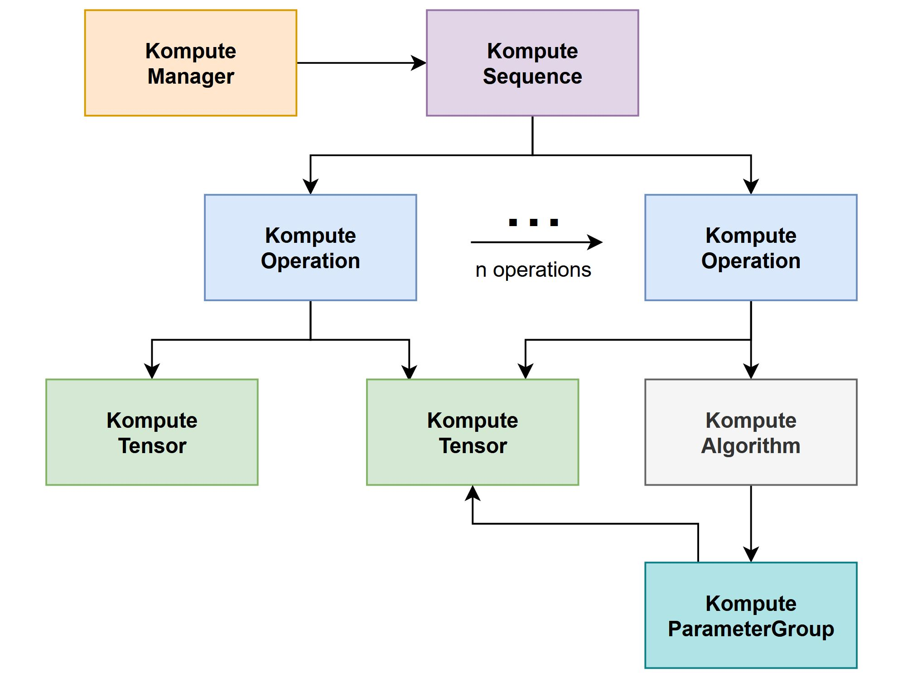

Memory Management Principles
=====================

The principle in Vulkan Kompute on memory management is summarised as follows:

* Explicit is better than implicit for specifying memory management 
* Interfaces for memory management are constant until freed
* Memory management responsibilities are acyclic from static object references
* Memory management by Kompute is optional and only in place if resource is created by Kompute

Vulkan Kompute is responsible for managing both the CPU and GPU memory allocations and resources, and is important that they are able to explicitly define when these objects are released or destroyed. Similarly, it's important that the memory resources created by the application are released safely.

Vulkan Kompute is built with the BYOV principle in mind (Bring your own Vulkan). This means that even though the top level resources are managing the memory to its owned resources, they themselves may not have full ownership of the GPU / Vulkan components themselves.

The memory ownership is hierarchically outlined in the component architecture - in this diagram, the arrows provide an intuition on the memory management ownership relationships (in this case you can ignore the arrow from the Algorithm, as this is the only one that as of today doesn't manage the memory of the Tensors).

Optional Memory Management
-------------

As outlined above, resource memory is only managed by Kompute if the resources are created by Kompute. Each of the Kompute components can also be initialised with externally managed resources. The :class:`kp::Manager` for example can be initialized with an external Vulkan Device. The first principle ensures that all memory ownership is explicitly defined when managing and creating Kompute resources.

